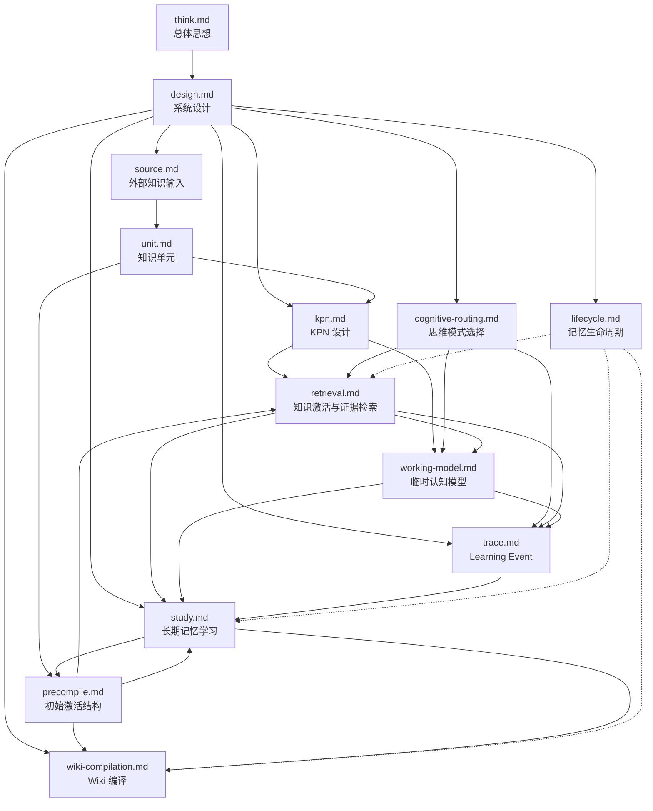

# 设计文档目录

本目录存放知识大脑的设计思想文档。

这些文档描述系统做什么、为什么这样做，以及各概念对象之间如何协作。它们不写具体数据库表、接口或实现细节；工程实现见 `docs/impl/`。

建议阅读顺序：

```text
think.md          总体思想与核心闭环
  -> design.md     系统设计总览
  -> source.md     外部材料如何进入
  -> unit.md       知识单元与知识点
  -> kpn.md        KnowledgePoint Network 激活与扩展边界
  -> precompile.md 导入阶段 vs 使用阶段；ActivationLink
  -> cognitive-routing.md  思维模式选择与问题分流
  -> retrieval.md  分层检索与证据查找
  -> working-model.md      复杂问题的临时认知模型
  -> trace.md      Learning Event 与 Trace
  -> study.md      长期记忆学习
  -> lifecycle.md  记忆生命周期
  -> wiki-compilation.md   Wiki 编译与长期沉淀
```

## 文档列表

| 文档 | 标题 | 内容简介 |
| --- | --- | --- |
| [think.md](./think.md) | 知识大脑总体思想 | 定义知识大脑的目标与边界；说明为何不是普通知识库、Agent 平台或知识图谱；描述从材料进入到 Wiki 沉淀的核心闭环，以及简单/复杂问题分流原则。 |
| [design.md](./design.md) | 知识大脑系统设计 | 把 `think.md` 的总体思想转化为系统设计；定义核心对象（含 KPN）、完整链路和 Agent 协作边界；是阅读其他专题文档前的总览入口。 |
| [source.md](./source.md) | 外部知识输入 | 描述外部材料如何进入系统、转换为规范化 Markdown 并保留来源；区分文档、对话、网页等不同材料类型及其处理方式。 |
| [unit.md](./unit.md) | 知识单元 | 定义知识单元与知识点的区别；说明如何从材料形成最小完整知识包，以及如何保留来源位置以支持追溯；定义 KnowledgePoint Network（KPN）作为知识点间的轻量上下文补充层。 |
| [kpn.md](./kpn.md) | KnowledgePoint Network 设计 | 定义 KPN 的定位、激活边界、扩展边界和停止条件；说明 KPN 与 Concept、KnowledgePoint、ActivationLink 的职责边界。 |
| [precompile.md](./precompile.md) | 初始激活结构 | 区分导入阶段形成的材料侧知识，与使用阶段形成的认知侧结构；说明领域、概念、ActivationLink 为何来自使用而非导入。 |
| [cognitive-routing.md](./cognitive-routing.md) | 思维模式选择 | 描述系统如何根据问题类型、熟悉度、不确定性和风险选择处理模式；定义直接记忆、快速检索、工作模型、查证、冲突检测等思维模式。 |
| [retrieval.md](./retrieval.md) | 知识激活与证据检索 | 描述 ActivationLink、目录结构树、全文检索和外部证据的分层检索路径；说明 KPN 如何在核心知识点召回后做局部上下文补充；说明认知结构检索与补充查找如何协作。 |
| [working-model.md](./working-model.md) | 临时认知模型 | 描述复杂问题如何组织本次思考的工作结构；说明 KPN 如何补充上下文变量；说明它与检索、Learning Event 和 Study 之间的关系。 |
| [trace.md](./trace.md) | Learning Event 与 Trace | 定义 Learning Event 与 Trace；说明检索事件是主学习驱动、用户反馈是补充加速；系统只记录对长期记忆学习有价值的事件和结果，不记录完整思考过程。 |
| [study.md](./study.md) | 长期记忆学习 | 描述 Study 如何根据 Learning Event 调整长期记忆；说明 ActivationLink 演化主要由检索事件累积驱动、无需依赖用户纠正；区分 KPN 与 ActivationLink 的学习边界；说明 Working Model 结构如何经多次事件提炼为实践路径；区分材料层、认知层和表达层学习。 |
| [lifecycle.md](./lifecycle.md) | 记忆生命周期 | 说明知识为何需要状态管理；描述生命周期如何影响激活、ActivationLink 和 Wiki 页面，以及如何区分当前可用与历史解释知识。 |
| [wiki-compilation.md](./wiki-compilation.md) | Wiki 编译与长期知识沉淀 | 定义 Wiki 页面的定位与类型；说明 Wiki 如何由 Study 根据 Learning Event 判断重编译，而非依赖完整 Trace。 |

## 文档关系

下面用流程图表示文档之间的主要依赖与协作关系。实线箭头表示「上游概念 feeds 下游」；虚线表示「横切关注点，影响多个环节」。



### 关系说明

**总体层**

- `think.md` 提供哲学与边界；`design.md` 将其展开为系统级对象和链路，是其他文档的总纲。

**材料进入与编码**

- `source.md` → `unit.md`：外部材料规范化后，形成可追溯的知识单元和知识点，以及知识点间的轻量 KPN 连接。
- `unit.md` → `kpn.md`：KPN 定义知识点间上下文补充的激活、扩展和停止边界。
- `unit.md` → `precompile.md`：知识单元是长期记忆的基础；导入阶段只形成材料侧结构和初始线索。

**问题处理**

- `cognitive-routing.md` 决定问题走轻量路径还是深度路径，并调度后续环节。
- `retrieval.md` 在 ActivationLink、目录结构树、全文检索和外部证据之间分层召回；核心 KnowledgePoint 确定后，在 Working Model 需要时由 KPN 做局部上下文补充。
- `working-model.md` 承接复杂问题，把激活结果和证据组织为本次思考结构；其完整内容不默认进入 Trace。

**学习与沉淀**

- `trace.md` 仅在产生学习价值时记录 Learning Event，是 Study 的事实样本来源；**检索事件（activation_success / failure / gap）是主驱动，不依赖用户纠正**。
- `study.md` 根据 Learning Event 调整长期记忆，不是复盘每次回答或完整推理过程；**ActivationLink 演化主要由检索事件累积驱动**。
- `wiki-compilation.md` 是表达层学习的产物；Wiki 更新由 Study 根据 Learning Event 驱动，而非完整 Trace。

**横切：生命周期**

- `lifecycle.md` 贯穿激活、学习和 Wiki 维护，确保过期或已被替代的知识不会通过旧路径继续误导当前回答。

## 核心链路（跨文档）

各文档共同描述的同一条主线遵循 **Answer First** 原则：先完成回答，再在有学习价值时沉淀事件并调整长期记忆。

```text
外部材料（source）
  -> 知识单元和知识点（unit）
  -> KnowledgePoint Network 补充上下文（unit / kpn / retrieval）
  -> 使用中形成 ActivationLink（precompile / study）
  -> 思维模式选择（cognitive-routing）
  -> 分层检索与证据查找（retrieval）
  -> 复杂问题进入临时认知模型（working-model）
  -> 生成回答

Only if learning value exists:
  -> Learning Event（trace）
  -> Study 根据 Learning Event 调整长期记忆（study）
  -> 稳定结果可进入 Wiki 编译（wiki-compilation）
        ↑
  生命周期管理（lifecycle）持续影响激活、学习与 Wiki 有效性
```

职责总览：

```text
ActivationLink 负责找到知识；
KPN 负责补充上下文；
Working Model 负责组织思考；
Learning Event / Trace 负责记录学习相关事件和结果；
Study 负责根据 Learning Event 修正长期记忆；
Wiki 负责长期表达沉淀。
```

设计约束：

```text
KPN 是上下文补充层，不是主检索层；
ActivationLink 仍然是正式认知激活路径；
Trace 不是每次问答的必经步骤，不记录完整思考过程；
Study 是长期记忆学习机制，不是思考复盘系统；
Knowledge Brain 专注于知识经验累积，不承担完整人类反思与任务复盘。
```

最终目标：让 Trace 从「过程记录系统」降级为「学习事件记录系统」；让 Study 从「思考复盘系统」调整为「长期记忆学习系统」；避免过度解释、过度记录和认知负担扩散。
