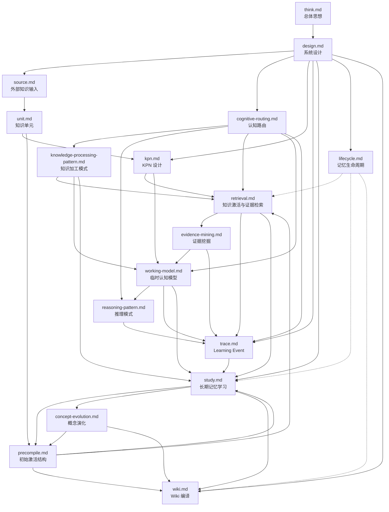

# 设计文档目录

本目录存放知识大脑的设计思想文档。

这些文档描述系统做什么、为什么这样做，以及各概念对象之间如何协作。它们不写具体数据库表、接口或实现细节；工程实现见 `docs/impl/`。

建议阅读顺序：

```text
think.md          总体思想与核心闭环
  -> design.md     系统设计总览
  -> source.md     外部材料如何进入
  -> unit.md       知识单元与知识点
  -> kpn.md        KnowledgePoint Network 激活与扩展边界
  -> precompile.md 导入阶段 vs 使用阶段；ActivationLink
  -> cognitive-routing.md  认知路由与问题分流
  -> knowledge-processing-pattern.md  领域知识加工模式与证据槽位
  -> retrieval.md  分层检索与证据查找
  -> evidence-mining.md    片段级证据挖掘
  -> working-model.md      复杂问题的认知工作空间
  -> reasoning-pattern.md  领域无关推理形式
  -> trace.md      Learning Event 与 Trace
  -> study.md      长期记忆学习
  -> concept-evolution.md  概念的新增、合并与拆分
  -> lifecycle.md  记忆生命周期
  -> wiki.md   Wiki 编译与长期沉淀
```

## 文档列表

| 文档 | 标题 | 内容简介 |
| --- | --- | --- |
| [think.md](./think.md) | 知识大脑总体思想 | 定义知识大脑的目标与边界；说明为何不是普通知识库、Agent 平台或知识图谱；描述从材料进入到 Wiki 沉淀的核心闭环，以及简单/复杂问题分流原则。 |
| [design.md](./design.md) | 知识大脑系统设计 | 把 `think.md` 的总体思想转化为系统设计；定义核心对象（含 KPN、Claim）与知识表达的五层分层（KU / KP / ActivationLink / Claim / Wiki）及各层对认知系统的消费规则；是阅读其他专题文档前的总览入口。 |
| [source.md](./source.md) | 外部知识输入 | 描述外部材料如何进入系统、转换为规范化 Markdown 并保留来源；区分文档、对话、网页等不同材料类型及其处理方式。 |
| [unit.md](./unit.md) | 知识单元 | 定义知识单元与知识点的区别；说明如何从材料形成最小完整知识包，以及如何保留来源位置以支持追溯；定义 KnowledgePoint Network（KPN）作为知识点间的轻量上下文补充层。 |
| [kpn.md](./kpn.md) | KnowledgePoint Network 设计 | 定义 KPN 的定位、激活边界、扩展边界和停止条件；说明 KPN 与 Concept、KnowledgePoint、ActivationLink 的职责边界。 |
| [precompile.md](./precompile.md) | 初始激活结构 | 区分导入阶段形成的材料侧知识，与使用阶段形成的认知侧结构；说明领域、概念、ActivationLink 为何来自使用而非导入；定义 ActivationLink 的目标形态——认知入口规则（触发条件 + 认知条件 → 知识点及建议槽位角色），以及多链接身份与条件的来源置信约束。 |
| [cognitive-routing.md](./cognitive-routing.md) | 认知路由 | 定义找 / 浅想 / 深想三条处理路径及其判据；说明"找 -> 浅想 -> 深想"的单向升级链与程序化升级信号；定义约束深想扩展的固定处理上限。 |
| [knowledge-processing-pattern.md](./knowledge-processing-pattern.md) | 知识加工模式 | 定义领域相关的知识组织模板与证据槽位；说明模式为何前置于检索以跨越词汇鸿沟；说明槽位填充如何承担知识转换、缺口暴露和关系发现；说明模式挂载 Domain/Concept 与库演化。 |
| [retrieval.md](./retrieval.md) | 知识激活与证据检索 | 描述 ActivationLink、目录结构树、全文检索和外部证据的分层检索路径；说明知识加工模式槽位如何驱动召回扩展；说明 KPN 如何在核心知识点召回后做局部上下文补充；说明认知结构检索与补充查找如何协作。 |
| [evidence-mining.md](./evidence-mining.md) | 证据挖掘 | 定义知识单元与证据的粒度区别；说明 Rerank 之后如何从知识单元中逐字摘选片段级证据；说明逐字摘录与程序校验如何拦截幻构；说明片段级证据对引用精度和学习信号的价值。 |
| [working-model.md](./working-model.md) | 临时认知模型 | 定义深想路径的认知工作空间：由知识加工模式实例化的三层结构（问题 / 槽位含状态 / 结论）与生命周期；说明槽位上受控综合的出处校验约束；说明它与检索、Learning Event 和 Study 之间的关系。 |
| [reasoning-pattern.md](./reasoning-pattern.md) | 推理模式 | 定义领域无关的推理形式库（演绎/归纳/因果/比较/决策/编排）；说明其工程形态是推理脚手架而非推理引擎；说明输入是 Working Model、选择由 intent 映射、结论必须回链槽位证据。 |
| [trace.md](./trace.md) | Learning Event 与 Trace | 定义 Learning Event 与 Trace；说明检索事件是主学习驱动、用户反馈是补充加速；系统只记录对长期记忆学习有价值的事件和结果，不记录完整思考过程。 |
| [study.md](./study.md) | 长期记忆学习 | 描述 Study 如何根据 Learning Event 调整长期记忆；说明 ActivationLink 演化主要由检索事件累积驱动、无需依赖用户纠正；区分 KPN 与 ActivationLink 的学习边界；说明 Working Model 结构如何经多次事件提炼为实践路径；区分材料层、认知层和表达层学习。 |
| [concept-evolution.md](./concept-evolution.md) | 概念演化 | 定义领域下概念的新增、合并与拆分机制：演化信号来自 Learning Event 累积，候选不参与激活，晋升与合并由人工确认；说明合并时 ActivationLink、KPP 挂载和 Wiki 标记的迁移语义，以及与 preset 数据的优先级关系。 |
| [lifecycle.md](./lifecycle.md) | 记忆生命周期 | 说明知识为何需要状态管理；描述生命周期如何影响激活、ActivationLink 和 Wiki 页面，以及如何区分当前可用与历史解释知识。 |
| [wiki.md](./wiki.md) | Wiki 编译与长期知识沉淀 | 定义 Wiki 页面的定位与类型；定义编译的同源双产物（面向人的页面 + 面向程序的 Claim 集合）与认知包（组装视图，非独立存储）；说明主题识别如何独立于材料侧成熟度、从真实提问中识别；说明 Wiki 如何由 Study 根据 Learning Event 判断重编译，而非依赖完整 Trace。 |

## 文档关系

下面用流程图表示文档之间的主要依赖与协作关系。实线箭头表示「上游概念 feeds 下游」；虚线表示「横切关注点，影响多个环节」。


```mermaid
flowchart TB
  think["think.md<br/>总体思想"]
  design["design.md<br/>系统设计"]

  source["source.md<br/>外部知识输入"]
  unit["unit.md<br/>知识单元"]
  kpn["kpn.md<br/>KPN 设计"]
  precompile["precompile.md<br/>初始激活结构"]

  routing["cognitive-routing.md<br/>认知路由"]
  kpp["knowledge-processing-pattern.md<br/>知识加工模式"]
  retrieval["retrieval.md<br/>知识激活与证据检索"]
  mining["evidence-mining.md<br/>证据挖掘"]
  working["working-model.md<br/>临时认知模型"]
  rp["reasoning-pattern.md<br/>推理模式"]

  trace["trace.md<br/>Learning Event"]
  study["study.md<br/>长期记忆学习"]
  concept["concept-evolution.md<br/>概念演化"]
  lifecycle["lifecycle.md<br/>记忆生命周期"]
  wiki["wiki.md<br/>Wiki 编译"]

  think --> design

  design --> source
  design --> routing
  design --> kpn
  design --> trace
  design --> study
  design --> lifecycle
  design --> wiki

  source --> unit
  unit --> kpn
  unit --> precompile
  kpn --> retrieval
  kpn --> working

  precompile --> retrieval
  precompile --> study
  precompile --> wiki

  routing --> kpp
  routing --> rp
  routing --> retrieval
  routing --> working
  routing --> trace

  kpp --> retrieval
  kpp --> working
  kpp --> study

  retrieval --> mining
  retrieval --> trace
  retrieval --> study

  mining --> working
  mining --> trace

  working --> rp
  rp --> trace

  working --> trace
  working --> study

  trace --> study

  study --> precompile
  study --> concept
  concept --> precompile
  concept --> wiki
  study --> wiki

  lifecycle -.-> retrieval
  lifecycle -.-> study
  lifecycle -.-> wiki
```

### 关系说明

**总体层**

- `think.md` 提供哲学与边界；`design.md` 将其展开为系统级对象和链路，是其他文档的总纲。

**材料进入与编码**

- `source.md` → `unit.md`：外部材料规范化后，形成可追溯的知识单元和知识点，以及知识点间的轻量 KPN 连接。
- `unit.md` → `kpn.md`：KPN 定义知识点间上下文补充的激活、扩展和停止边界。
- `unit.md` → `precompile.md`：知识单元是长期记忆的基础；导入阶段只形成材料侧结构和初始线索。

**问题处理**

- `cognitive-routing.md` 把问题路由到找、浅想或深想路径，并调度后续环节；升级由程序信号触发。
- `knowledge-processing-pattern.md` 在问题理解阶段按领域给出知识组织结构与证据槽位：槽位驱动检索扩展（跨越词汇鸿沟）、承载知识转换、以填充率定义证据充分性；模式实例是 Working Model 的骨架。
- `reasoning-pattern.md` 在填充完成的 Working Model 上执行领域无关的推理形式（演绎/归纳/因果/比较/决策/编排）；工程形态是推理脚手架（步骤模板 + 输出契约 + 程序检查），结论必须回链槽位证据。
- `retrieval.md` 在 ActivationLink、目录结构树、全文检索和外部证据之间分层召回；核心 KnowledgePoint 确定后，在 Working Model 需要时由 KPN 做局部上下文补充。
- `evidence-mining.md` 在 Rerank 之后把知识单元粒度的候选加工为片段粒度的证据：逐字摘选、程序校验、可回链来源；有模式时按槽位定向摘选。
- `working-model.md` 承接深想路径，把激活结果和证据组织为本次思考结构；其完整内容不默认进入 Trace。

**学习与沉淀**

- `trace.md` 仅在产生学习价值时记录 Learning Event，是 Study 的事实样本来源；**检索事件（activation_success / failure / gap）是主驱动，不依赖用户纠正**。
- `study.md` 根据 Learning Event 调整长期记忆，不是复盘每次回答或完整推理过程；**ActivationLink 演化主要由检索事件累积驱动**。
- `concept-evolution.md` 承接 Study 的认知层结构信号：候选概念自动识别，新增、合并与拆分由人工确认后执行，挂载的链接、模式和 Wiki 标记随概念迁移。
- `wiki.md` 是表达层学习的产物；Wiki 更新由 Study 根据 Learning Event 驱动，而非完整 Trace。

**横切：生命周期**

- `lifecycle.md` 贯穿激活、学习和 Wiki 维护，确保过期或已被替代的知识不会通过旧路径继续误导当前回答。

## 核心链路（跨文档）

各文档共同描述的同一条主线遵循 **Answer First** 原则：先完成回答，再在有学习价值时沉淀事件并调整长期记忆。

```text
外部材料（source）
  -> 知识单元和知识点（unit）
  -> KnowledgePoint Network 补充上下文（unit / kpn / retrieval）
  -> 使用中形成 ActivationLink（precompile / study）
  -> 认知路由：找 / 浅想 / 深想（cognitive-routing）
  -> 知识加工模式识别与证据槽位生成（knowledge-processing-pattern，深想）
  -> 分层检索与证据查找（retrieval）
  -> 片段级证据挖掘（evidence-mining）
  -> 深想路径进入临时认知模型（working-model）
  -> 推理模式执行受约束推理（reasoning-pattern）
  -> 生成回答

Only if learning value exists:
  -> Learning Event（trace）
  -> Study 根据 Learning Event 调整长期记忆（study）
  -> 稳定结果可编译为 Wiki 页面与 Claim 集合（wiki.md）
        ↑
  生命周期管理（lifecycle）持续影响激活、学习与 Wiki 有效性
```

职责总览：

```text
ActivationLink 负责找到知识，并建议其在 Working Model 中的用途；
KPN 负责补充上下文；
Knowledge Processing Pattern 负责给出领域知识结构；
Evidence Mining 负责摘选证据；
Working Model 负责承载本次认知工作空间；
Reasoning Pattern 负责在其上执行推理；
Learning Event / Trace 负责记录学习相关事件和结果；
Study 负责根据 Learning Event 修正长期记忆；
Claim 负责稳定结论的可执行复用；
Wiki 负责长期表达沉淀，是 Claim 集合的可读投影。
```

设计约束：

```text
KPN 是上下文补充层，不是主检索层；
ActivationLink 仍然是正式认知激活路径；
Trace 不是每次问答的必经步骤，不记录完整思考过程；
Study 是长期记忆学习机制，不是思考复盘系统；
Knowledge Brain 专注于知识经验累积，不承担完整人类反思与任务复盘。
```

最终目标：让 Trace 从「过程记录系统」降级为「学习事件记录系统」；让 Study 从「思考复盘系统」调整为「长期记忆学习系统」；避免过度解释、过度记录和认知负担扩散。
