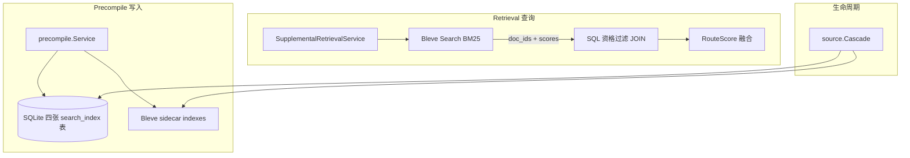

# 词法检索实现方案（Bleve + gse）

本文档规定第一版材料侧全文检索的工程实现。

词法检索不属于核心认知结构检索主链路，而是 `SupplementalRetrievalService` 的多路召回之一。它与 `source_search_index`、`unit_search_index`、`knowledge_point_search_index`、`outline_search_index` 四张 SQLite 表配合使用：SQLite 保存元数据与资格过滤依据，Bleve 保存倒排索引并负责 BM25 打分。

详细检索语义见：

```text
docs/impl/retrieval.md
docs/impl/precompile.md
docs/impl/schema.md
```

## 定位

第一版词法检索的目标：

```text
支持中文/英文混合 query 的材料侧召回；
使用应用层分词 + BM25，不依赖数据库厂商全文能力；
保持 DB 无关：SQLite 只做结构化存储，倒排索引落盘为 sidecar；
与 cognitive activation、outline tree match 结果在 retrieval 层融合。
```

第一版明确不做：

```text
SQLite FTS5；
gojieba / CGO 分词；
独立搜索引擎服务（Elasticsearch 等）；
向量语义索引（后续独立方案）。
```

## 技术选型

| 组件 | 包 | 职责 |
|------|-----|------|
| 词法引擎 | `github.com/blevesearch/bleve/v2` | 倒排索引、查询、BM25 打分、字段 boost |
| 分词 | `github.com/go-ego/gse` | 纯 Go 中文分词（jieba 算法实现） |
| Bleve 插件 | `github.com/vcaesar/gse-bleve` | 将 gse 注册为 Bleve custom tokenizer/analyzer |

不接受 CGO，因此不使用 `gojieba` / `blevejieba`。

Analyzer 默认配置：

```text
dicts: embed, zh
opt: search-hmm
```

`embed, zh` 使用 gse 内嵌词典，无需外挂 dict 文件。可选 `user_dict_path` 追加领域词。

## 架构



### 职责划分

| 层 | 组件 | 职责 |
|----|------|------|
| 分词 | gse tokenizer | 中文/英文混合切词；可选用户词典 |
| 词法检索 | Bleve v2 | 倒排索引、查询、BM25、字段 boost |
| 元数据 | SQLite | source of truth、`status`、JOIN `knowledge_units` / `source_documents` |
| 应用层 | retrieval | source filter、outline filter、与 cognitive 结果融合 |

分词在索引和查询两侧走同一套 analyzer，保证「亲口交代」等跨词表达在写入与检索时 token 一致。

## Bleve 索引设计

由 `internal/searchindex.Manager` 管理四个独立 Bleve 索引，与 SQLite 四表一一对应：

| Bleve 索引 | 磁盘子目录 | Doc ID | 可搜字段（boost） |
|------------|-----------|--------|-------------------|
| `sources` | `{index_dir}/sources` | `source_document_id` | `title^3`, `description^3`, `top_outline_summary^2` |
| `units` | `{index_dir}/units` | `unit_id` | `title^3`, `center^2`, `body` |
| `points` | `{index_dir}/points` | `knowledge_point_id` | `text^2` |
| `outlines` | `{index_dir}/outlines` | `outline_index_id`（SQL `osi.id`） | `outline_path^2`, `outline_summary^3`, `unit_title^2`, `unit_center` |

每个文档额外保存 stored field（不参与检索）：`source_document_id`、`status`。

索引目录默认：`{storage.root}/searchindex`。

启动时写入 `meta.json`（版本号 + 分词配置 hash）。索引缺失或版本不匹配时，从 SQLite `status='active'` 行全量 `RebuildAll`。

## Manager API

包路径：`internal/searchindex`。

```go
type Manager interface {
    Open(ctx context.Context) error
    Close() error

    IndexSource(ctx, doc SourceDoc) error
    IndexUnit(ctx, doc UnitDoc) error
    IndexPoint(ctx, doc PointDoc) error
    IndexOutline(ctx, doc OutlineDoc) error
    DeleteBySource(ctx, sourceDocumentID string) error
    DeleteUnit(ctx, unitID string) error

    SearchSources(ctx, query string, size int) ([]ScoredID, error)
    SearchUnits(ctx, query string, size int) ([]ScoredID, error)
    SearchPoints(ctx, query string, size int) ([]ScoredID, error)
    SearchOutlines(ctx, query string, size int) ([]ScoredID, error)

    RebuildAll(ctx context.Context, db *sql.DB) error
}
```

`ScoredID` 包含 `ID` 与 Bleve BM25 `Score`。

## 配置

`configs/config.example.yaml` 增加：

```yaml
search:
  enabled: true
  index_dir: data/searchindex
  segmenter:
    dicts: "embed, zh"
    mode: search-hmm
  user_dict_path: ""
  default_size: 50
  min_normalized_score: 0.3
```

| 字段 | 说明 |
|------|------|
| `enabled` | 是否启用 Bleve；`false` 时不应走 LIKE 回退（实现完成后移除 LIKE） |
| `index_dir` | Bleve 索引根目录 |
| `segmenter.dicts` | gse 词典配置 |
| `segmenter.mode` | gse 分词模式，映射到 `opt` |
| `user_dict_path` | 可选用户词典 |
| `default_size` | 每路 Bleve 召回上限 |
| `min_normalized_score` | 归一化 BM25 下限，用于 supplemental route_score |

## 写入路径

### Precompile

[`internal/knowledge/precompile/service.go`](../../internal/knowledge/precompile/service.go) 在 SQL upsert 成功后增量写 Bleve：

```text
UpsertSourceSearchIndex      -> IndexSource
UpsertUnitSearchIndex        -> IndexUnit
UpsertKnowledgePointSearchIndex -> IndexPoint
UpsertOutlineSearchIndex     -> IndexOutline
```

Bleve 写失败记录 warning，不阻断 precompile job；由启动时 `RebuildAll` 兜底。

### Source Cascade

[`internal/knowledge/source/cascade.go`](../../internal/knowledge/source/cascade.go) 在更新四张 `*_search_index.status` 时同步 Bleve：

```text
status != active  -> DeleteBySource(source_document_id)
RestoreKnowledge  -> 从 SQL 重读 active 行并 re-index
```

不在 Bleve 内单独维护 `status` 字段更新，采用删/重建避免 stale token。

## 读取路径

[`internal/services/retrieval/repository.go`](../../internal/services/retrieval/repository.go) 四处 `Search*Index`：

```text
1. Manager.Search*(query, default_size) -> []ScoredID
2. 空结果直接返回
3. SQL: WHERE id IN (...) + eligibility JOIN（ku.active、sd 状态、source_filters）
4. 按 Bleve score 排序；row 携带 LexicalScore
```

[`internal/services/retrieval/supplemental.go`](../../internal/services/retrieval/supplemental.go)：

```text
buildUnitTextHits / buildKnowledgePointHits 使用归一化 BM25 作为 route_score；
归一化：score / maxScore，阈值由 search.min_normalized_score 控制；
textMatchScore 仅保留给 cognitive activation 等非词法路径。
```

outline 节点检索：Bleve 负责 `outline_path` / `outline_summary` / `unit_title` / `unit_center` 的词面召回；`outline_type`、`path_prefix` 等结构化过滤仍在 SQL 层执行。词法召回主要用于阶段二的节点预筛，以及 `outline_path_search` 回退。

文档级目录树检索采用两阶段语义路由：

```text
阶段一 document route match:
  SearchSources(query, source_top_k)  // 宽召回，N 默认 8~12
  -> LLM 联合 Domain 信号与文档摘要排序
  -> 输出候选 source_document_id + source_score

阶段二 outline tree match:
  对每个候选 source 加载去正文树结构
  -> 可选 Bleve 预筛节点
  -> LLM 返回合法 source_id + node_id
  -> 展开到 unit_id，输出 tree_score

回退:
  阶段一失败 -> BM25 source 排序
  阶段二失败 -> 该 source 内 SearchOutlines + SQL 过滤（outline_path_search）
```

有 source_filters 时，阶段一直接使用 `source_filters` 作为候选集合，但仍可做摘要排序。

无 source_filters 时，不得跳过阶段一直接跨全库扁平检索所有 outline 节点。

`SearchOutlines` 的结果不得跨所有 source 扁平融合后再决定文档。

同一 query 命中多个文档时，每个文档应保留独立的 `source_score`、`tree_score` 和 `matched_path`，融合阶段再与 unit / point / cognitive 召回合并。

`outline_summary` 是目录节点覆盖范围说明，权重应高于单纯路径标题。

原因：

```text
outline_path 负责结构定位；
outline_summary 负责范围语义召回；
unit_title / unit_center 负责把目录节点和具体知识单元连接起来。
```

## 与 SQLite 表的关系

四张 `*_search_index` 表保留，职责为：

```text
precompile 写入的 source of truth；
rebuild 的数据源；
资格过滤 JOIN（knowledge_units、source_documents）；
审计与 trace 关联。
```

词法召回不再使用 `LIKE '%query%'`。

## 用户词典（可选）

可从 `presets` 中的 Domain / Concept 名称导出 `user_dict.txt`，启动时 gse `LoadDict` 追加。第一版可跳过，依赖 embed zh 词典；领域词切分不准时再启用。

## 测试要求

| 测试 | 内容 |
|------|------|
| `internal/searchindex/manager_test.go` | 中文「亲口交代」跨字段命中；英文混合 |
| `internal/searchindex/rebuild_test.go` | fixture DB 全量 rebuild 后 doc 数与 SQLite active 行一致 |
| `internal/services/retrieval/*_test.go` | Bleve 召回 + SQL 过滤；disabled source 不命中 |
| `internal/knowledge/precompile/service_test.go` | precompile 后 Bleve 可搜到 unit |
| `internal/e2e/minimal_loop_test.go` | 端到端检索仍可用 |

## 风险与缓解

| 风险 | 缓解 |
|------|------|
| gse 分词精度略低于 CGo gojieba | 接受；后续加 user_dict |
| Bleve 与 SQLite 不一致 | 启动 `RebuildAll`；precompile Bleve 写失败仅 warn |
| BM25 分数尺度与旧 `textMatchScore` 不同 | 归一化 + `min_normalized_score` 配置 |
| 索引目录损坏 | `meta.json` 检测 + 自动 rebuild |

## 实施顺序

```text
1. 依赖 + internal/searchindex 骨架
2. config.search + main 启动 Open/Rebuild
3. 增加 sources / units / points / outlines 四个 Bleve 索引
4. precompile 增量写 + cascade 同步
5. retrieval 改为两阶段目录树检索（document route match + outline tree match）+ 通道归一化融合
6. 测试与阈值校准；移除 LIKE 路径
```

## 后续扩展（不在第一版）

```text
向量 sidecar（chromem-go / USearch）与 Bleve 在 retrieval 层 RRF 融合；
从 presets 自动生成 user_dict；
跨 perspective 索引隔离（第一版单 default perspective 共用一个索引目录）。
```
